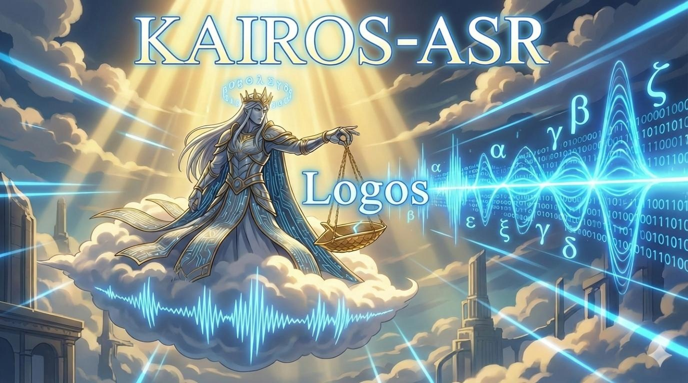

# Kairos Automatic Speech Recognition

[](https://pypi.org/project/kairos-asr/)
[](https://pypi.org/project/kairos-asr/)
[](https://pepy.tech/project/kairos-asr)
[](LICENSE)
[](https://huggingface.co/Alenkar/KairosASR)


---

**Kairos ASR** — высокопроизводительная библиотека распознавания русской речи на базе 
[**GigaAM-style RNN-T**](https://github.com/salute-developers/GigaAM) архитектуры и **ONNX**.

Проект сфокусирован на скорости, точности и удобстве интеграции в микросервисы и десктопные приложения.

## 📄 Описание

---

- Оптимизированный ONNX-инференс
- Работает на **CPU**, **GPU (CUDA, extra `[gpu]`)** и **Metal (MPS, extra `[metal]`)**
- Поддержка временных меток (**word-level**, **sentence-level**)
- Итеративная обработка с выводом прогресса и **ETA**
- Встроенный **Voice-Activity-Detection ([Silero VAD](https://github.com/snakers4/silero-vad))**
- Поддержка **длинных аудио**
- Простая установка и использование
- Поддержка **Windows**, **Linux** и **macOS**
## ⚡ TL;DR
- `pip install kairos-asr[gpu]` (Windows/Linux) или `pip install kairos-asr[metal]` (macOS)
- Запустить: `kairos-asr transcribe example.wav` или см. Python сниппет ниже.
- Полное руководство: `docs/USAGE.md`.

## 📦 Установка

Веса доступны на Hugging Face: [Alenkar/KairosASR](https://huggingface.co/Alenkar/KairosASR)

## 🖥️ Системные требования
- `ffmpeg` должен быть доступен в `PATH` (используется для загрузки и ресемплинга аудио).
- Доступ в интернет. При первом запуске скачиваются веса моделей.
- Для ускорения скачиваний и избежания лимитов рекомендуется установить токен HF: `export HF_TOKEN=...` (или `huggingface-cli login`).

### Быстрый старт (CPU)

```bash
pip install kairos-asr[cpu]
```

### macOS (Metal/MPS)

```bash
pip install kairos-asr[metal]
```

На macOS ONNX-инференс работает на CPU, а Torch-часть (feature extraction) использует MPS при доступности.

### Поддержка GPU (CUDA)

1) Пакет с GPU-опциями:
```bash
pip install kairos-asr[gpu]
```

2) Torch/Torchaudio под вашу версию CUDA:
```bash
# пример под CUDA 12.1/12.2 (cu121)
pip install torch==2.5.1 torchaudio==2.5.1 --index-url https://download.pytorch.org/whl/cu121 --upgrade
```
Найдите свой индекс (cu118, cu121 и т.д.) на pytorch.org и подставьте в команду.

## 🚀 Использование (Python)

Минимальный пример:
```python
from kairos_asr import KairosASR

asr = KairosASR()  # device="auto" по умолчанию
result = asr.transcribe(wav_file="audio.wav")
print(result.full_text)
```

Требования к входному аудио:
- Файлы, поддерживаемые `ffmpeg`; автоматический ресемплинг до 16 kHz.
- Рекомендуется WAV PCM 16-bit, mono, 16 kHz; стерео приводится к моно.
- Длинные записи режутся Silero VAD на ~15–25 c (жёсткий лимит ~30 c) и объединяются.

## Использование (CLI)
Существует несколько команд для работы через терминал.

```bash
# Показать информацию
kairos-asr info

# Проверить окружение и вывести информацию
kairos-asr doctor

# Список моделей (показывает локальное наличие и путь)
kairos-asr list

# Скачать все модели
kairos-asr download

# Скачать только encoder
kairos-asr download encoder

# Перевести файл в текст
kairos-asr transcribe <wav_file>
```

## 🧠 Как работает

---

1. VAD делит аудио на сегменты (до 25 секунд).
2. Каждый сегмент преобразуется в Mel-spectrogram.
3. RNN-T модель (Encoder + Predictor + Joint).
4. Выравнивание слов по фреймам.
5. Объединение сегментов в финальную разметку.

Архитектура и общий пайплайн вдохновлены проектом **GigaAM**.

## 📜 Лицензия и происхождение

---

### Код
Часть исходного кода основана на проекте [**GigaAM**](https://github.com/salute-developers/GigaAM)
и используется в соответствии с условиями лицензии MIT.
Оригинальный [**проект GigaAM**](https://github.com/salute-developers/GigaAM):
* License: MIT
* Copyright (c) 2024 GigaChat Team

### Модели
Используемые веса моделей происходят из проекта **GigaAM**, но были:
* конвертированы в формат **ONNX**,
* оптимизированы для **CPU/GPU-inference**,
* адаптированы для использования в **Kairos ASR**,
* частично произведена тонкая настройка (**Lora**) на кастомных данных.

Права на исходные веса принадлежат правообладателям проекта **GigaAM**. 
Использование осуществляется в рамках лицензии MIT.

Если вы используете **KairosASR** в исследовательских или коммерческих целях — проверьте совместимость с лицензией
оригинальной модели (**GigaAM**).

## 📊 Планы развития

---

* [ ] Batch-inference.
* [ ] Realtime-inference (микрофон) и чанки с ndarray.
* [ ] Diarization (разделение спикеров).
* [ ] Тесты.
* [ ] Дальнейшее дообучение на специализированных данных.
* [ ] Скрипт для Lora finetune на своих данных.
* [ ] Увеличение Vocabulary.
* [x] Пакет для установки.
* [x] Веса на Hugging Face.

## 👤 Автор

---

Разработано и поддерживается: **([Alexey Shimokhin / Alenkar](https://github.com/Alenkar))**. \
Если вы используете **Kairos ASR** в своих проектах — ссылка или отзыв приветствуются.
